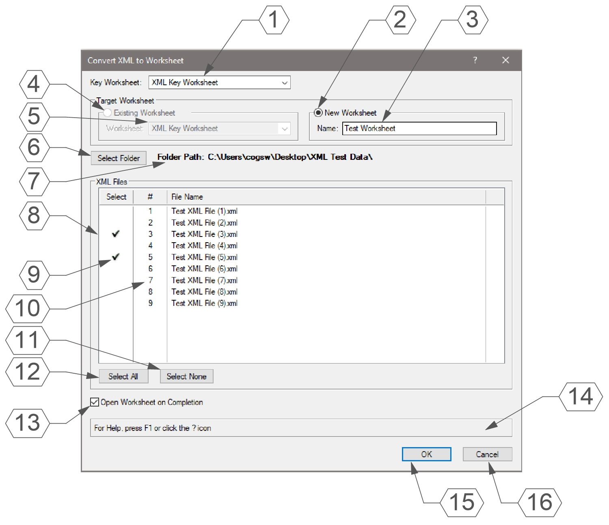
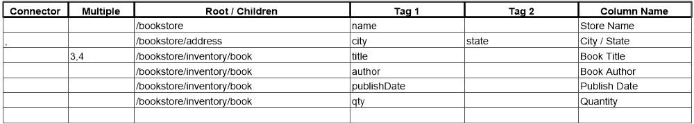
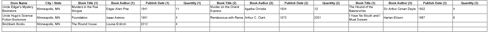

# Convert XML to Worksheet

Menu Command

## Version

1.0.0 - 08/15/2024

This plug-in is written in Vectorscript (Pascal) and can be used in any version of [Vectorworks](https://www.vectorworks.net) 2019 or newer.

## Description

Converts XML data to Vectorworks Worksheet data. Any newly generated Worksheet will have all data justified to the left and vertically centered with Wrap Text and Auto-Fit Row Height turned on.

## Instructions

1. Run menu command
2. Select a Worksheet to use as a key to XML files
3. Either a target Worksheet by choosing to either use either an **Existing Worksheet** or generate a **New Worksheet**
4. Choose press **Select Folder** to select a folder containing XML files
5. Select XML files to pull data from by checking the **Select** column
6. Determine the order of XML extraction by dragging and dropping the number in the **#** column
7. Check the **Open Worksheet on Completion** box to open the target Worksheet after the operation completes
8. Press **OK** to create / update Worksheet with data from XML file

## Dialog Box Explanation



1. Drop-down menu used to select **Key Worksheet**. This choice is remembered for the next time the command is executed.
2. Select the **New Worksheet** radio button to generate a new Worksheet using XML data.
3. Enter a name for the new Worksheet. The name must be unique.
4. Select the **Existing Worksheet** radio button to append data to an existing Worksheet. This option is disabled if the drawing only contains 1 Worksheet object.
5. Drop-down menu used to select the **Target Worksheet** to receive XML data. This must be a different Worksheet than the chosen **Key Worksheet**. This choice is remembered for the next time the command is executed.
6. Press the **Select Folder** button to open an explorer dialog to choose the folder containing XML files. Pressing the button will clear data in the **XML Files** box.
7. Path of the current folder.
8. All XML files found in current folder.
9. Place a checkmark in the **Select** column to mark the XML file for data extraction.
10. Click and drag the number in the **#** column upward or downward to change the order of XML data extraction.
11. Press the **Select None** button to clear all checkmarks from the **Select** column of all XML files.
12. Press the **Select All** button to place a checkmark in the **Select** column of all XML files.
13. Check the **Open Worksheet on Completion** box to open the **Target Worksheet** after completion of the operation.
14. **Help Box**, mousing over any dialog box element will display an explanation of the element here.
15. Pressing the **OK** button will close the dialog box and create or update the **Target Worksheet** with the data from selected XML files.
16. Pressing the **Cancel** button will close the dialog box without changing any Worksheet objects.

## Key Worksheet Explanation

This menu command requires the use of a Worksheet object to serve as a key to choose which XML data to extract. This worksheet will used to determine the tags extracted, what the columns of the Worksheet will be named, and the column widths. The **Key Worksheet** also has the ability to combine values from two different tags with a connector and to specify extraction in cases of having multiple Children elements.

This worksheet requires and empty row at the end and **6** columns:

1. **Connector**: The contents of this column will be used to join two values when a second tag is specified
2. **Multiple**: The contents of this column determine the rules when there are multiple Children. The contents should be two numbers separated by a comma.  The first number determines the number of Children to extract and the second number determines the number of tags in the Child.
3. **Root/Children**: The contents of this column should have the Root and Children tags separated by a '/' character. This should not contain the end-point tag.
4. **Tag 1**: The contents of this column determine the end-point tag to extract the value of.
5. **Tag 2**: If this cell contains text, the command will concatenate the value of the tag in the **Tag 1** column, the contents of the **Connector** column, and the value of the tag found in this column.
6. **Column Name**: The contents of this column determine the name of the columns in generated Worksheets. In cases of multiple Children, '(#)' will be appended to the column name. The width of this column will also determine the width of the columns in generated Worksheets.

### Key Worksheet Example

Consider the following XML file:

```xml
<?xml version="1.0" encoding="utf-8"?>
<bookstore>
	<name>Uncle Edgar's Mystery Bookstore</name>
	<address>
		<city>Minneapolis</city>
		<state>MN</state>
	</address>
	<inventory>
		<book>
			<title>Murders in the Rue Morgue</title>
			<author>Edgar Allen Poe</author>
			<publishDate>1841</publishDate>
			<qty>11</qty>
		</book>
		<book>
			<title>Murder on the Orient Express</title>
			<author>Agatha Christie</author>
			<publishDate>1934</publishDate>
			<qty>12</qty>
		</book>
		<book>
			<title>The Hound of the Baskervilles</title>
			<author>Sir Arthur Conan Doyle</author>
			<publishDate>1902</publishDate>
			<qty>4</qty>
		</book>
	</inventory>
</bookstore>
```

Let's say that we want to combine the *city* and *state* values into one column and we want the Worksheet to contain data for three instances of the *book* Child.  We would use a **Key Worksheet** that looks like this:



The resulting Worksheet with a couple more examples would look something like:



Due to some idiosyncrasies with the Vectorscript functions regarding Worksheets, an empty row must be at the bottom of a Worksheet if you wish to append data at the bottom (rows can only be inserted before a given row, not after).  Do not remove the empty bottom row unless you are sure you will not need to add more data.

## Installation Instructions

There are two methods of installation, direct download of the plug-in or through the **JNC Tools Free Manager** plug-in.

### Direct Download:

1. Download [source plug-in file](Convert%20XML%20to%20Worksheet.vsm)
2. Place downloaded file inside the **Vectorworks User Folder** within the **Plug-ins** directory
3. Restart Vectorworks

### JNC Tools Free Manager

1. Run the **JNC Tools Free Manager** menu command
2. Select the **Reset Plug-in Obj Classes** command
3. Press the **Install / Update** button
4. Press **Close** to close the dialog box
5. Restart Vectorworks

## Adding the Plug-in to your Workspace

1. Open the **Workspace Editor** by going to **Tools - Workspaces - Edit Current Workspace**
2. Select the **Menus** tab
3. In the box on the left, find and expand the **JNC** category
4. In the box on the right, find a suitable menu to place the command in, such as **Tools** or **Modify**
5. Click and drag the **Convert XML to Worksheet** command from the box on the left to the desired menu location in the box on the right
6. Click **OK** to close the editor

## Localization Instructions

The plug-in can be localized to your native language without having access to the source code.  This can be achieved by following the instructions below:

1. Open the **Plug-in Manager** by going to **Tools - Plug-ins - Plug-in Manager**
2. Select the **Third-party Plug-ins** tab
3. Select the **Convert XML to Worksheet** command
4. Click the **Customize** button
5. Select the **Strings** tab
6. Double-click a category, such as **Dialog Strings**
7. Select a string to edit and press the **Edit** button
8. Write a new string and press the **OK** button until you are back to the **Plug-in Manager**

The categories for this plug-in are as follows:

- **3000** - *Dialog Strings*: These strings are used in the dialog box and can all freely be changed
- **4000** - *Dialog Help Strings*: These strings are used in the Help Box at the bottom of the dialog box and can all be freely changed
- **5000** - *Misc Strings*: These strings serve multiple purposes in the code, only strings **5002**, **5003**, **5004**, and **5005** can be changed

## Release Notes

| Date | Version | Note |
| :---: | :---: | :--- |
| 08/15/2024 | 1.0.0 | Initial Release |

## Known Bugs

No Known Bugs

## Feature Requests

| Date Logged | Request |
| :---: | :--- |
| 08/15/2024 | Add Attribute functionality |

## License

Copywrite (c) Jesse Cogswell (JNC Tools)

Permission is hereby granted, free of charge, to any person or organization
obtaining a copy of this software (the "User") and associated documentation files (the "Software"),
to use, reproduce, distribute, execute, and transmit the Software.

The User is not permitted to modify or attempt to reverse engineer the source code.  The User may
localize the Software using approved methods from within the Vectorworks software.

THE SOFTWARE IS PROVIDED "AS IS", WITHOUT WARRANTY OF ANY KIND, EXPRESS OR
IMPLIED, INCLUDING BUT NOT LIMITED TO THE WARRANTIES OF MERCHANTABILITY,
FITNESS FOR A PARTICULAR PURPOSE, TITLE AND NON-INFRINGEMENT. IN NO EVENT
SHALL THE COPYRIGHT HOLDERS OR ANYONE DISTRIBUTING THE SOFTWARE BE LIABLE
FOR ANY DAMAGES OR OTHER LIABILITY, WHETHER IN CONTRACT, TORT OR OTHERWISE,
ARISING FROM, OUT OF OR IN CONNECTION WITH THE SOFTWARE OR THE USE OR OTHER
DEALINGS IN THE SOFTWARE.